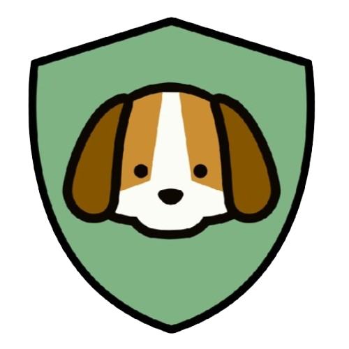

  

  

# 
Ani+ Seguros

<strong>Desenvolvimento de um aplicativo dedicado a denúncias de maus-tratos contra animais,   conectando usuários a organizações protetoras de forma eficiente e segura.</strong>

   

 

## 📖 Introdução

  O Ani+ Seguros é um aplicativo criado para facilitar a denúncia de maus-tratos a animais, garantindo que essas informações cheguem rapidamente às autoridades competentes e organizações de proteção. Nosso objetivo é criar um canal acessível e seguro, permitindo que qualquer pessoa denuncie abusos contra animais de maneira rápida e eficaz.

  Além do sistema de denúncias, o app conta com funcionalidades que ajudam a conscientizar os usuários, fornecendo materiais educativos, informações sobre leis de proteção animal e acompanhamento do status das denúncias enviadas.

 

## 📌 Principais Funcionalidades

- ✔ **Cadastro de usuários e autoridades** – Permite que cidadãos e órgãos competentes utilizem a plataforma de forma segura.  
- ✔ **Sistema de denúncias** – Usuários podem relatar casos de maus-tratos, anexando provas como fotos e vídeos.  
- ✔ **Encaminhamento automático** – As denúncias são direcionadas automaticamente para ONGs e autoridades responsáveis.  
- ✔ **Histórico de denúncias** – Acompanhe o status das denúncias enviadas na plataforma.  
- ✔ **Material educativo** – Acesso a conteúdos sobre direitos dos animais e como agir em casos de maus-tratos.  
 

## 🎨 Protótipo

  
  
  
  
  

 

   

 

## 🛠️ Recursos e Tecnologias Utilizadas

<h3 align="center">
  <strong>🎨 Protótipos e Design</strong>
</h3>

   

<h3 align="center">
  <strong>🔍 Planejamento e Organização</strong>
</h3>

   
   

<h3 align="center">
  <strong>🖥️ Desenvolvimento Front-end</strong>
</h3>

   
   

 

  <i>(A definir outras tecnologias para o back-end e banco de dados)</i>

---

## 💡 Nome dos Integrantes

- *João Vitor Corrêa*
- *João Pedro de Aguiar Bastos*
- *Luís Bolina Martins*
- *Rafael Gonçalves Filho*
 

  Made with 🤍 by <strong><a href="https://github.com/LuisinnBM" target="_blank">LuisinnBM</a></strong>

